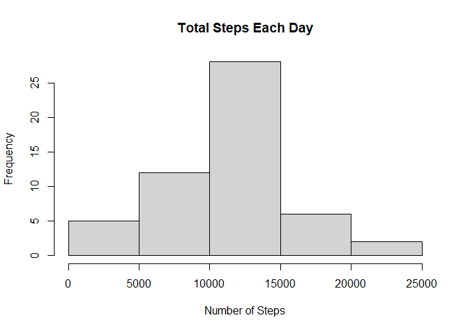
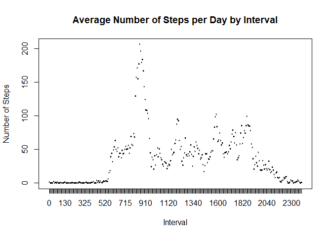
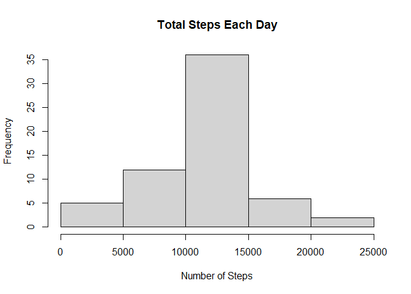
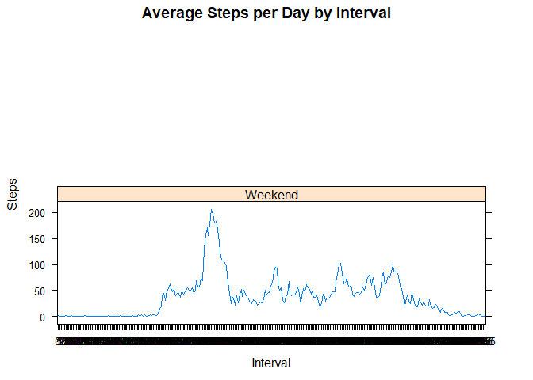

## Loading and preprocessing the data

```r
library(knitr)
```

```
## Warning: package 'knitr' was built under R version 4.0.3
```

```r
library(ggplot2)
library(data.table)
```

```
## Warning: package 'data.table' was built under R version 4.0.3
```

```r
activity <- unzip("activity.zip")
activity_csv <- read.csv("activity.csv", header=TRUE, sep=",")
activity_csv$date <- as.Date(activity_csv$date, format="%Y-%m-%d")
activity_csv$interval <- as.factor(activity_csv$interval)
str(activity_csv)
```

```
## 'data.frame':	17568 obs. of  3 variables:
##  $ steps   : int  NA NA NA NA NA NA NA NA NA NA ...
##  $ date    : Date, format: "2012-10-01" "2012-10-01" ...
##  $ interval: Factor w/ 288 levels "0","5","10","15",..: 1 2 3 4 5 6 7 8 9 10 ...
```

```r
head(activity_csv, 5)
```

```
##   steps       date interval
## 1    NA 2012-10-01        0
## 2    NA 2012-10-01        5
## 3    NA 2012-10-01       10
## 4    NA 2012-10-01       15
## 5    NA 2012-10-01       20
```


## What is mean total number of steps taken per day?

```r
steps_by_day <- aggregate(steps ~ date, activity_csv, sum)
hist(steps_by_day$steps, main = paste("Total Steps Each Day"),xlab="Number of Steps")
```

<!-- -->


```r
steps_mean <- mean(steps_by_day$steps)
steps_mean
```

```
## [1] 10766.19
```


```r
steps_median <- median(steps_by_day$steps)
steps_median
```

```
## [1] 10765
```


## What is the average daily activity pattern?


```r
steps_by_interval <- aggregate(steps ~ interval, activity_csv, mean)
plot(steps_by_interval$interval,steps_by_interval$steps, type="l", xlab="Interval", ylab="Number of Steps",main="Average Number of Steps per Day by Interval")
```

<!-- -->

```r
max_interval <- steps_by_interval[which.max(steps_by_interval$steps),1]
max_interval
```

```
## [1] 835
## 288 Levels: 0 5 10 15 20 25 30 35 40 45 50 55 100 105 110 115 120 125 ... 2355
```


## Imputing missing values

```r
NA_values <- sum(!complete.cases(activity_csv))
NA_values
```

```
## [1] 2304
```
Our strategy will be based on replacing missing values with the mean value at the same interval across days.


```r
activity_csv_new <- activity_csv
index_of_na <- which(is.na(activity_csv_new$steps))
for (i in index_of_na) {
  activity_csv_new$steps[i] <- with(steps_by_interval, steps[interval = activity_csv_new$interval[i]])
}

new_missing_values <- sum(is.na(activity_csv_new$steps))
new_missing_values
```

```
## [1] 0
```

```r
steps_by_day_new <- aggregate(steps ~ date, data = activity_csv_new, FUN=sum)
colnames(steps_by_day_new) <- c("date", "steps")
hist(steps_by_day_new$steps, main = paste("Total Steps Each Day"),xlab="Number of Steps")
```

<!-- -->

```r
steps_mean_new <- mean(steps_by_day_new$steps)
steps_mean_new
```

```
## [1] 10766.19
```

```r
steps_median_new <- median(steps_by_day_new$steps)
steps_median_new
```

```
## [1] 10766.19
```
If there is a difference the estimates, there should be a difference between the means and the medians.

```r
diif_mean = steps_mean_new - steps_mean
diif_mean
```

```
## [1] 0
```

```r
diff_median = steps_median_new - steps_median
diff_median
```

```
## [1] 1.188679
```
So, there is a difference.

## Are there differences in activity patterns between weekdays and weekends?

```r
weekdays <- c("Monday", "Tuesday", "Wednesday", "Thursday", 
              "Friday")
activity_csv_new$dow = as.factor(ifelse(is.element(weekdays(as.Date(activity_csv_new$date)),weekdays), "Weekday", "Weekend"))
StepsTotalUnion <- aggregate(steps ~ interval + dow, activity_csv_new, mean)
library(lattice)
```

```
## Warning: package 'lattice' was built under R version 4.0.3
```

```r
xyplot(StepsTotalUnion$steps ~ StepsTotalUnion$interval|StepsTotalUnion$dow, main="Average Steps per Day by Interval",xlab="Interval", ylab="Steps",layout=c(1,2), type="l")
```

<!-- -->

